# Overview:

Prometheus alerts are used to monitor metrics stored in [Azure Monitor managed services for Prometheus](https://learn.microsoft.com/en-us/azure/azure-monitor/essentials/prometheus-metrics-overview)
Prometheus alert rules are configured as part of [Prometheus rule groups](https://learn.microsoft.com/en-us/azure/azure-monitor/essentials/prometheus-rule-groups). They fire when the result of a PromQL expression resolves to true. Fired Prometheus alerts are displayed and managed like other alert types.
<br/>
### Reference:
* [Rule groups](https://learn.microsoft.com/en-us/azure/azure-monitor/essentials/prometheus-rule-groups)
* [Alerting rules](https://prometheus.io/docs/prometheus/latest/configuration/alerting_rules/)
* [Provisioning prometheus collect by Bicep](https://github.com/Azure/prometheus-collector/blob/main/AddonBicepTemplate/recommendedMetricAlerts.bicep)

You can use the templete of the following pipeline to provision the alert rules into workspace in Azure:
* [The is a link for templete]()

### Maintain the configuration of alert rules:

* You can refer to the above examples to add your `main.bicep` into your templetes.
<br/>

* Set up your different rule groups: 
   > _examples_: 
     `Kubernetes Cluster`
     `Kubernetes Node`
     `Kubernetes Namespace`

* Add your alert rules:
```json
{
        alert: '% Memory Usage'
        expression: 'sum by (namespace) (container_memory_rss{job="cadvisor"})/ sum by (namespace) (kube_resourcequota{resource="limits.memory",type="hard"}) > .90 '
        for: 'PT10M'
        annotations: {
          description: 'Current Memory usage of {{ $labels.namespace }} is: {{  $value | humanizePercentage }}'
        }
        enabled: true
        severity: severitynamespace
        resolveConfiguration: {
          autoResolved: false
          timeToResolve: 'PT10M'
        }
        actions: [
          {
            actionGroupId: devActionGroupResourceId
          }
          {
            actionGroupId: testActionGroupResourceId
          }
          {
            actionGroupId: emailActionGroupResourceId
          }
        ]
      }
```
<br/>

> [!TIP]
> You can check the following table for reference.

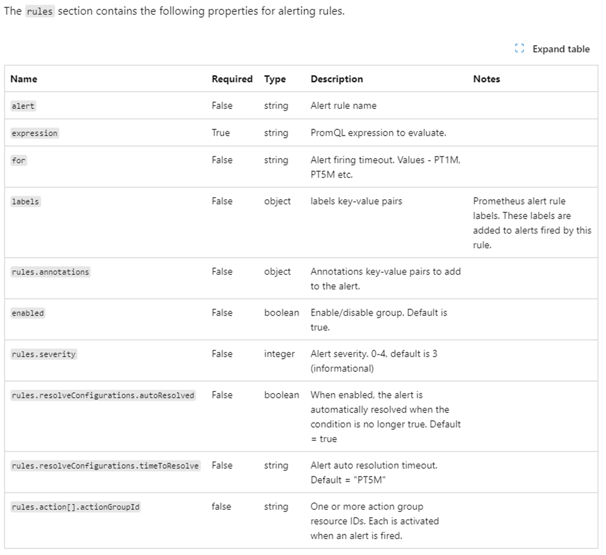

* Edit and preview your expressions in your Azure Portal:
  + Navigate to your Prometheus explorer.
  + Put your expression into `PromQL`
    > _example_: <br/><br/>
    ```sum by (namespace) (container_memory_rss{job="cadvisor"})/ sum by (namespace) (kube_resourcequota{resource="limits.memory",type="hard"}) > .90```
  + Get your values from your expression:<br/><br/>
    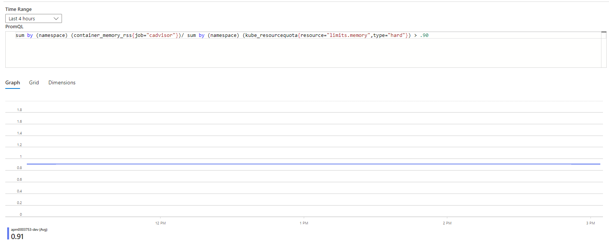
    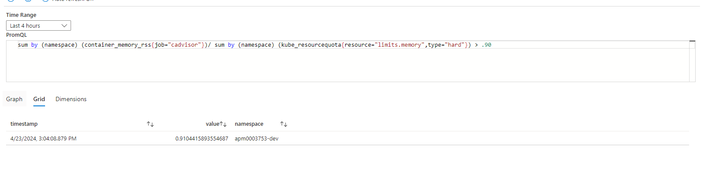

> [!NOTE]
> 1. If you have differenct enviroments, you can set up your alert rules in the same file.<br/>_examples:_<br/> ```resource namespaceAlertsNP 'Microsoft.AlertsManagement/prometheusRuleGroups@2023-03-01' = if ('${split(aksResourceId, '/')[8]}' == 'AKS-NP-002')```
> 2. The "autoResolved" should be “false”.
> 3. The service connection needs to have at least “Read” permission of the action group.

### Run your pipeline in Azure DevOps.
> [!TIP]
> You can get the pipeline templetes from [here]().

* Select your cluster and run your pipeline to update your alert rules:<br/><br/>
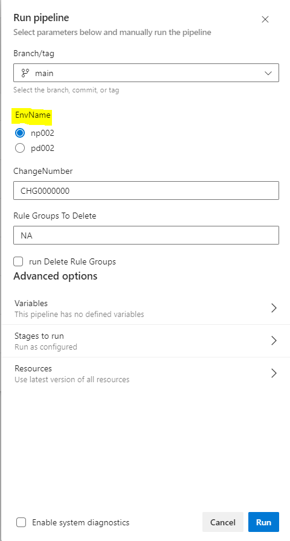

* Delete rule groups:
  - Put your rule group name into the below blank:<br/><br/>
  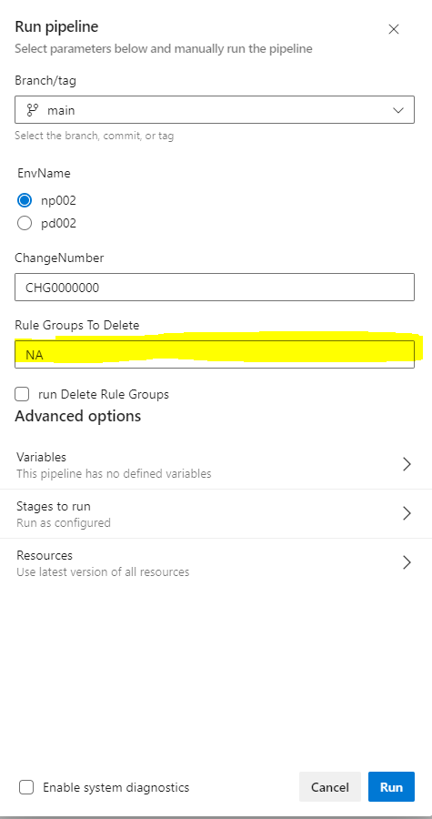
  - Select `run Delete Rule Groups`<br/><br/>
  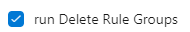

<br/><br/>

### Validate the Alert rules wether they have been modified successfully.

1. Check your alerts rules in Azure Protal:
- From `Azure Monitor workspace`:
   - Navigate to your cluster:<br/><br/>
   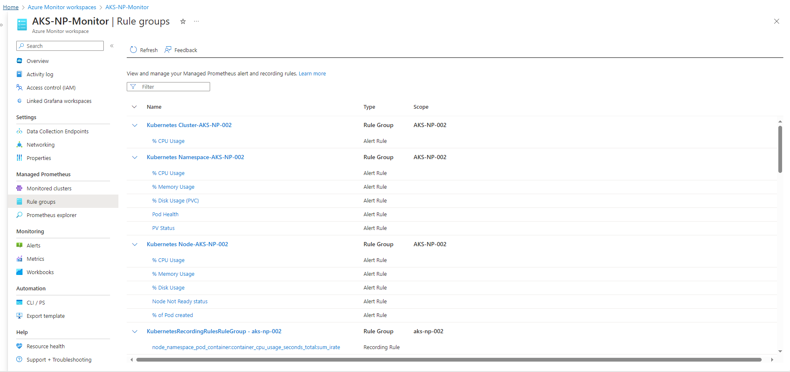
   - Click the rules you want to check:<br/><br/>
   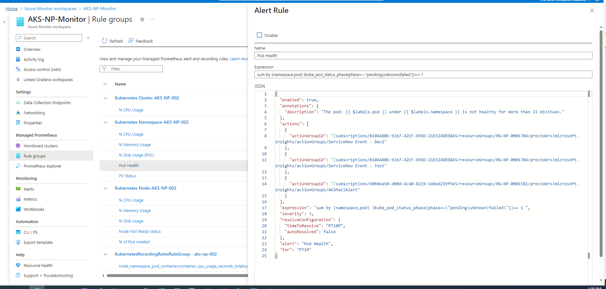
- From `Monitor`
   - Search `Monitor` in the search blank:<br/><br/>
   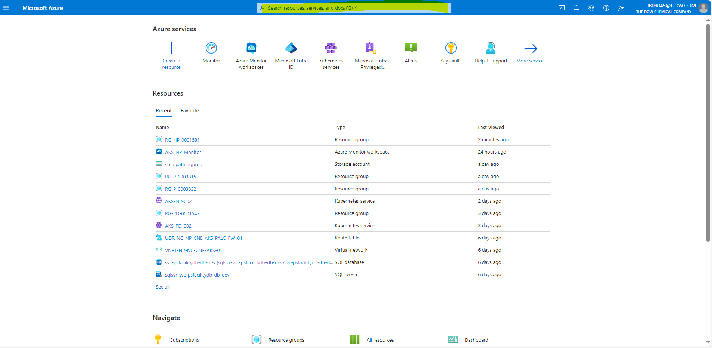
   - navigate to `Alerts`:<br/><br/>
   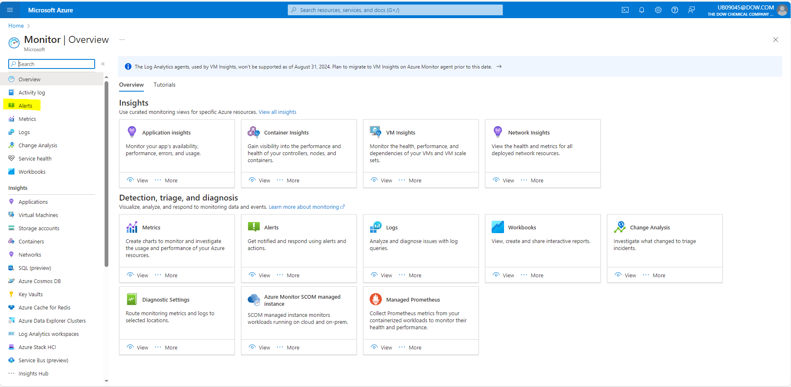
   - Click `Prometheus rule groups`:<br/><br/>
   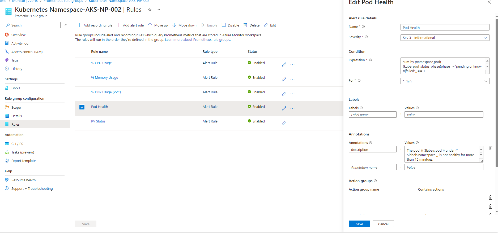
   - Click the alert rules you want to check:<br/><br/>
   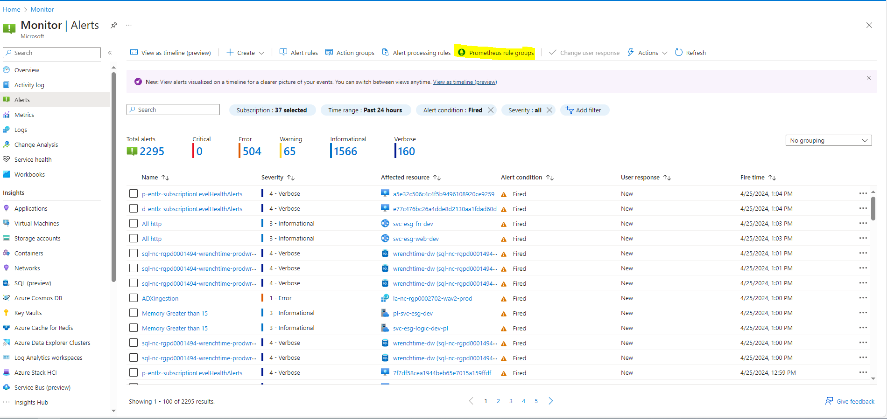
   - Go to `rules`:<br/><br/>
   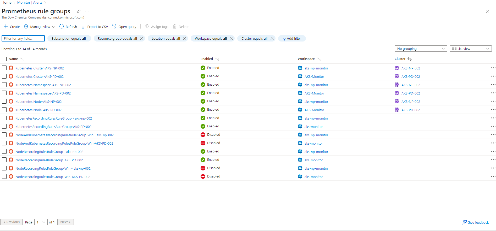
<br/>

2. Check the fired alerts:
   - From the previous step, go to `history`:<br/><br/>
   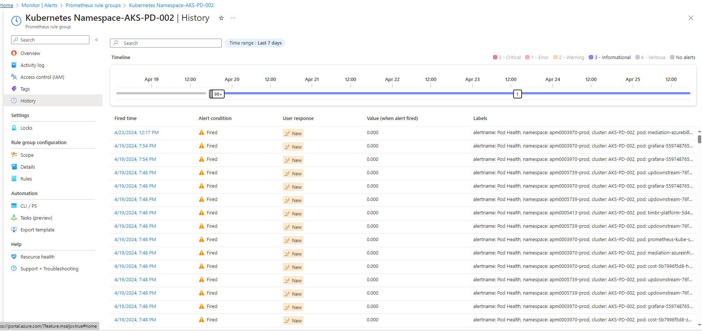
   - From the `alert`:<br/><br/>
     - Add a filter, choose `Monitor service`:<br/><br/>
     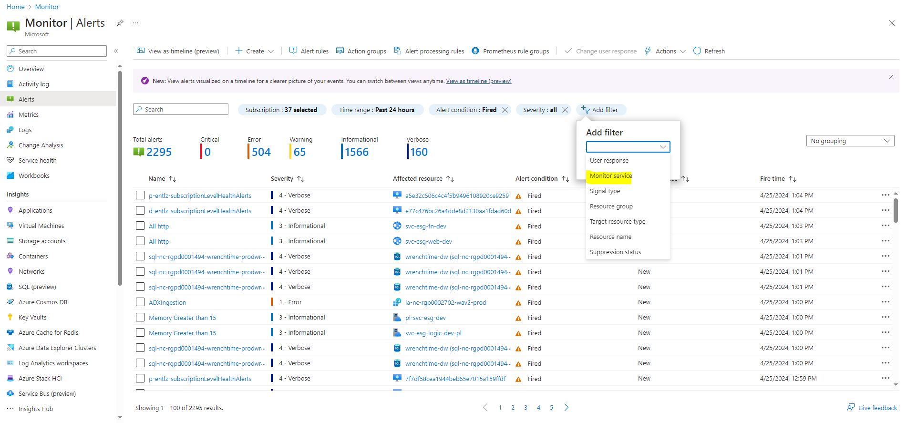
     - Select `Monitor service`, change `all` to `Prometheus`:<br/><br/>
     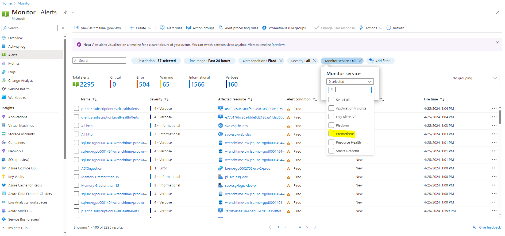 
     - You will find all the fired alerts here:<br/><br/>
     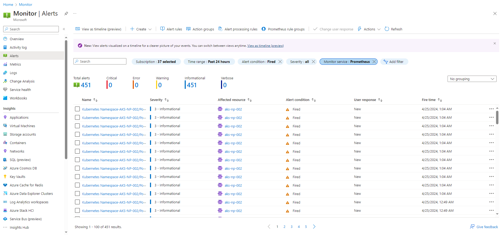  