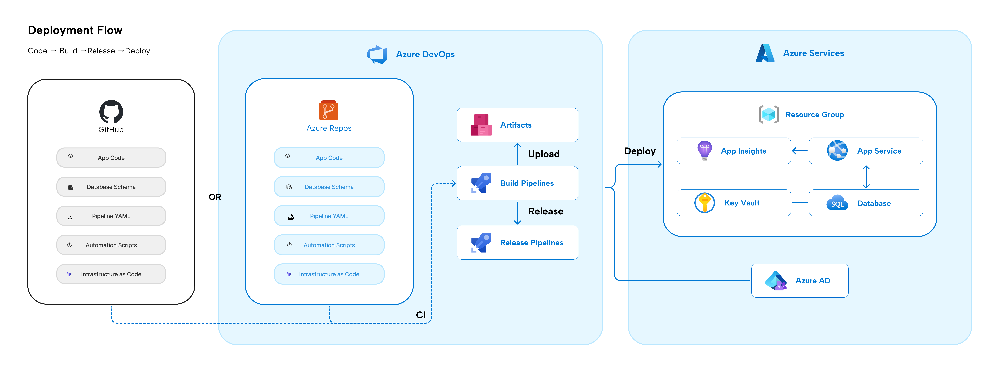

# Introduction: Implementing DevOps with Azure and GitHub

In this article, let's explore how to use Azure DevOps and GitHub to automate the deployment of an ASP.NET Core application to Azure App Service and SQL Database. The setup will cover project tracking, source control, build pipelines, and release pipelines. Additionally, we will integrate Azure AD, Key Vault, and Service Principal to manage secrets securely.

### Workflow:




### File Structure Overview
Below is the file structure for this setup:
```bash
├───DBScripts
├───pipeline-default
│   ├───steps
│   │   ├───build
│   │   ├───deploy-infra
│   │   └───deploy-solution
│   └───vars
└───scripts
    └───NetworkAccessRestrictions
```

### Project Tracking with Azure DevOps

Azure DevOps provides a comprehensive suite of tools to plan, track, and manage software development projects. The tools include Boards, Repos, Pipelines, and Artifacts. For project tracking, we will focus on Azure Boards, where you can create work items, track progress, and manage backlogs.

1. [Set up a project in Azure DevOps:](https://learn.microsoft.com/en-us/azure/devops/organizations/projects/create-project?view=azure-devops&tabs=browser) Create a project to track all work related to the application.
2. [Use Azure Boards:](https://learn.microsoft.com/en-us/azure/devops/boards/get-started/plan-track-work?view=azure-devops&tabs=agile-process) Create epics, user stories, tasks, and bugs to track the project's development.

### Source Control with GitHub
For source control, we will use GitHub, hosting our code in private repositories. GitHub integrates seamlessly with Azure DevOps, enabling a smooth CI/CD pipeline.
1. **GitHub Repositories:** Host your ASP.NET Core application in a private GitHub repository.

2. **Integrate GitHub with Azure DevOps:** This allows Azure Pipelines to pull code from GitHub for continuous integration and deployment

### Using Azure Pipelines for Build and Release

Azure Pipelines is a CI/CD service that automates the build, test, and release processes.

1. **Build Pipelines:** Define the steps to build your ASP.NET Core application. This includes restoring dependencies, building the application, running tests, and packaging the build artifacts.

2. **Release Pipelines:** Automate the deployment of the application to Azure App Service and SQL Database. The release pipeline will use the build artifacts from the build pipeline and deploy them to your Azure environment.

### Identity Management with Azure AD

For managing access and identity within Azure, we will implement Azure AD integration for secure access control.

[**1. Deploying an Azure AD Tenant**](https://azure.github.io/apim-lab/apim-lab/7-security/security-7-2-2-oauth2-create-aad.html)  
Azure Active Directory (Azure AD) is the identity and access management service used to manage users, devices, and applications. To use Azure AD for authentication, deploy an Azure AD tenant if you don't already have one.</br></br>
[**2. Sync Active Directory Domain to Azure AD**](https://learn.microsoft.com/en-us/azure/architecture/reference-architectures/identity/azure-ad)
If you are migrating from an on-premises Active Directory, you can sync your on-prem AD domain with Azure AD. Use Azure AD Connect to synchronize users and groups between the on-premises directory and Azure AD.

**3. Configuring App1 to Use a Service Principal**
A Service Principal in Azure AD allows applications and services to access resources in Azure securely. We will create a Service Principal for App1 and assign it the necessary permissions to access Azure resources like Key Vault.
```bash
# Create Service Principal
az ad sp create-for-rbac --name "App1-ServicePrincipal" --role Contributor --scopes /subscriptions/{subscription-id}/resourceGroups/{resource-group-name}
```
[**4. Integrating GitHub with Azure AD**](https://learn.microsoft.com/en-us/entra/identity/saas-apps/github-tutorial)
GitHub can be integrated with Azure AD to enable single sign-on (SSO). This integration allows GitHub users to authenticate using Azure AD credentials. This ensures seamless and secure access management for developers working on the project.

### DevOps Environment Setup
We will now focus on deploying the application to Azure, configuring source control for the database, and monitoring development progress with Azure DevOps

**1. Deploying App1 to Azure App Service**
We will deploy the ASP.NET Core application to Azure App Service using Terraform to automate infrastructure provisioning. The app will be configured to use a SQL Database for persistent storage.

**2. Source Control for the DB1 Schema**
The database schema (DB1) will be stored in GitHub and integrated with Azure Pipelines. The schema can be versioned, and any changes will trigger automatic deployment and updates.

1. Store database schema in GitHub as SQL scripts or migrations.

2. Use Azure DevOps Pipelines to deploy database updates alongside application deployments.

**3. Azure DevOps Dashboard for Stakeholder Monitoring**
An Azure DevOps dashboard will be created to provide stakeholders with insights into the development progress. The dashboard will display information such as the status of builds, releases, and work items.

1. Create a custom dashboard in Azure DevOps.
2. Add widgets for build status, release status, and active work items.
3. Share the dashboard with stakeholders to keep them updated.


### Using Azure Key Vault for Secret Management
To securely manage application secrets (such as database connection strings), we will use Azure Key Vault. Storing sensitive data in Key Vault ensures that secrets are never exposed in the codebase.
1. **Create a Key Vault:** Use Terraform to create a Key Vault resource.
2. **Store Database Connection String:** The database connection string will be stored in Key Vault as a secret.
3. **Service Principal Permissions:** The Service Principal will be granted access to retrieve the secret from Key Vault.

### Terraform Configuration
Here is an overview of how the infrastructure can be managed with Terraform. The configuration will automate the provisioning of App Service, SQL Database, and Key Vault.
```hcl
resource "azurerm_resource_group" "example" {
  name     = "example-resources"
  location = "East US"
}

resource "azurerm_app_service_plan" "example" {
  name                = "example-app-service-plan"
  location            = azurerm_resource_group.example.location
  resource_group_name = azurerm_resource_group.example.name
  kind                = "Linux"
  sku {
    tier = "Standard"
    size = "S1"
  }
}

resource "azurerm_web_app" "example" {
  name                = "example-app"
  location            = azurerm_resource_group.example.location
  resource_group_name = azurerm_resource_group.example.name
  app_service_plan_id = azurerm_app_service_plan.example.id
  https_only          = true

  app_settings = {
    "DATABASE_CONNECTION" = azurerm_key_vault_secret.db_connection.value
  }
}

resource "azurerm_sql_server" "example" {
  name                         = "examplesqlserver"
  resource_group_name          = azurerm_resource_group.example.name
  location                     = azurerm_resource_group.example.location
  version                      = "12.0"
  administrator_login          = "sqladmin"
  administrator_login_password = "Password123!"
}

resource "azurerm_sql_database" "example" {
  name                = "exampledb"
  resource_group_name = azurerm_resource_group.example.name
  location            = azurerm_resource_group.example.location
  server_name         = azurerm_sql_server.example.name
  sku_name            = "S1"
}

resource "azurerm_key_vault" "example" {
  name                        = "examplekeyvault"
  location                    = azurerm_resource_group.example.location
  resource_group_name         = azurerm_resource_group.example.name
  sku_name                    = "Standard"
  tenant_id                   = data.azurerm_client_config.example.tenant_id
}

resource "azurerm_key_vault_secret" "db_connection" {
  name         = "db-connection-string"
  value        = "Server=tcp:${azurerm_sql_server.example.fqdn},1433;Initial Catalog=${azurerm_sql_database.example.name};Persist Security Info=False;User ID=sqladmin;Password=Password123!;MultipleActiveResultSets=False;Encrypt=True;TrustServerCertificate=False;Connection Timeout=30;"
  key_vault_id = azurerm_key_vault.example.id
}
```

The templetes link: [here]()

### Conclusion
In this article, we explored how to integrate Azure DevOps, GitHub, and Azure services like App Service, SQL Database, and Key Vault to automate the CI/CD pipeline for an ASP.NET Core application. By using Terraform, we automated the infrastructure deployment, ensuring a seamless process from source code to production.

This setup provides secure management of secrets, easy access control with Azure AD, and streamlined deployment processes through Azure DevOps Pipelines